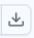

# Task 1.4: Download the attack tools

In this step, you'll download several third-party tools needed to complete the attacks in the lab exercises. These steps are all performed on the domain controller using the DC01 RDP session.

1. In a new browser tab, go to **[https://www.joeware.net/freetools/tools/netsess/](https://www.joeware.net/freetools/tools/netsess/)**

    1. Scroll to the bottom and select **Download Now**.

1. In the same browser tab, go to **[https://github.com/gentilkiwi/mimikatz/releases](https://github.com/gentilkiwi/mimikatz/releases)**

    1. Select **mimikatz_trunk.zip**.
    1. In the Download pop-up window, select the **Warning**.
    1. Select the **ellipses (...)** to the right, and then select **Keep**.
    1. In the **This app is unsafe** pop-up window, select **Show more**, and then select **Keep anyway**.

1. In the same browser tab, go to **[https://github.com/ANSSI-FR/ORADAD/releases](https://github.com/ANSSI-FR/ORADAD/releases)**

    1. Select **ORADAD.zip**

1. In the same browser tab, go to **[https://github.com/r3motecontrol/Ghostpack-CompiledBinaries](https://github.com/r3motecontrol/Ghostpack-CompiledBinaries)**

    1. On the This site has been reported as unsafe page, select **more information**, and then select **Continue to the unsafe site (not recommended)**.
    1. Select **Rubeus.exe**, and then select **Download raw file** .
    1. In the Download pop-up window, select the **warning**.
    1. Select the **ellipses (...)** to the right, and then select **Keep**.
    1. In the **Keep unsafe file** pop-up window, select **Keep anyway**.
    1. If prompted again, select **Keep anyway**.

1. In the same browser tab, go to **[https://learn.microsoft.com/en-us/sysinternals/downloads/psexec](https://learn.microsoft.com/en-us/sysinternals/downloads/psexec)**
    1. Select **Download PSTools**.

1. On the Windows taskbar, open File Explorer, and then select the **Downloads** folder.

    1. Copy PStools, Rubeus, ORADAD, mimikatz_trunk, and NetSess to the C:\Tools folder. 
    1. Extract each of the zipped files in the C:\Tools folder.
