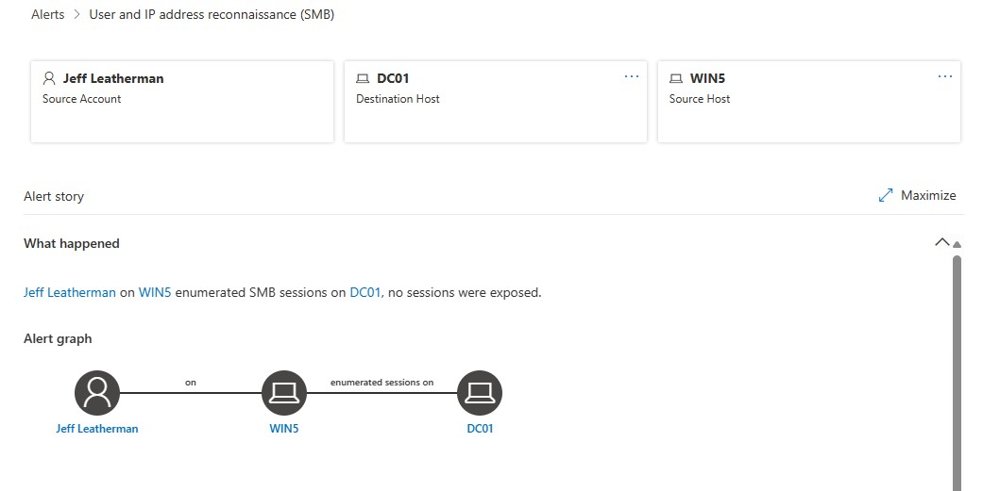
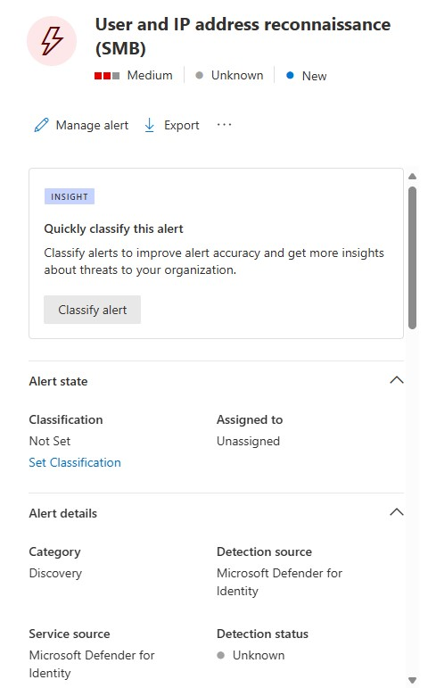
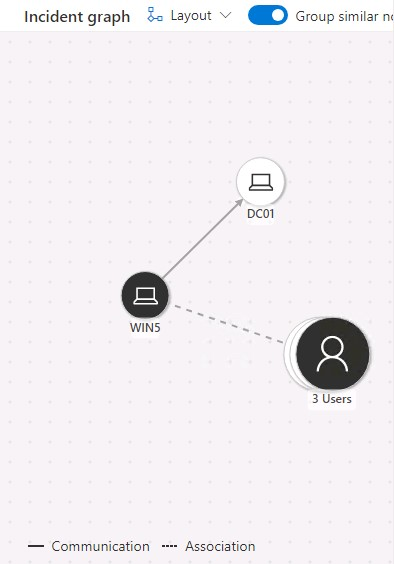
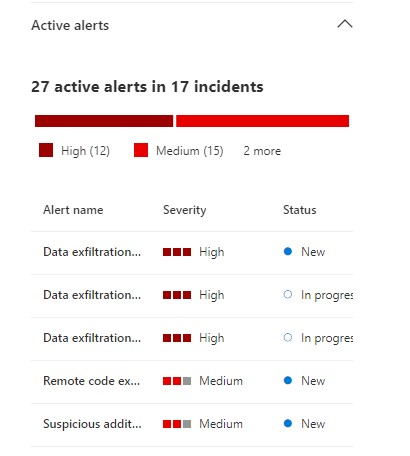
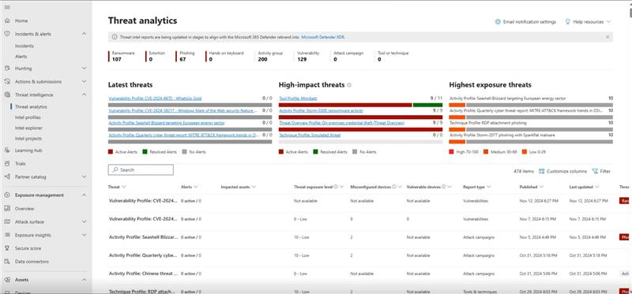

# Task 2.3: Investigate a reconnaissance and discovery alert

Microsoft Defender for Identity is a tool used to discover and analyze attacks. This is an important feature that will help ensure that your environment is secure. Please take your time when analyzing these attacks to become comfortable with their capabilities.

1. Switch to the **DC01 RDP session**.

1. In the browser, if you are not already, go to **[https://security.microsoft.com](https://security.microsoft.com)**.

1. On the left navigation panel, under **Incidents & alerts**, select **Alerts**.

1. Locate and then select the **User and IP address reconnaissance (SMB)** alert to show the details page.

    

    {: .warning }
    > It can take several minutes for the alert to appear. Wait a few minutes and then refresh the browser. If you don't see the alert, you can continue to the next section and return to investigate the alert in a few minutes.

1. Review the information regarding the **Alert story** on the details page.

1. Review the options on the blade on the right side of the details page

    {: .warning }
    

1. Under the Incident details, select the **Incident** link.

1. Review the Incident details page to discover related attacks. This will display additional alerts from the same user or machine.

1. Review the Incident graph.

    

1. Select each object in the Incident graph to review the available options menu.

1. Select one of the computer objects and then select **Device details** to display information relating to the object.

    

1. When finished reviewing the Device details, scroll back to the top, and then select **Back to incident details**.

    

1. Go to **[security.microsoft.com](security.microsoft.com)**, and in **Threat intelligence** and select **Threat analytics** to and then review the details of the report. 

    {: .note }
    > Everything is now integrated with the XDR portal, and MDI is no longer a separate entity.

    

1. Close the **Threat Analytics** tabs and return to the **Incident-Microsoft Defender** tab.

1. Select the **Alerts** tab, and then select **User and IP address reconnaissance (SMB)** to return to the alert details page.

1. On the right panel, select **Manage alert**.

    

1. On the **Manage alert** blade, configure the options using the following information:

    | Heading | Value |
    |:---------|:---------|
    | Status   | **In progress**  |
    | Assigned to   | **AlexW**   |
    |Classification  | **Multi staged attack** |
    |Comment | **This is part of a multi staged attack and requires further investigation. It has been assigned to Alex Wilbur.**  |

1. Select **Save**, and then close the **Manage alert** blade.
