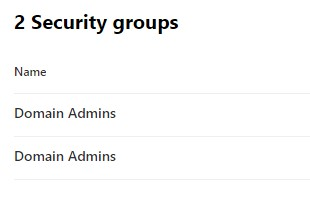

# Task 3.2: Investigate a persistence and privilege escalation alert

Microsoft Defender for Identity is a tool used to discover and analyze attacks. This is an important feature that will help ensure that your environment is secure. Please take your time when analyzing these attacks to become comfortable with their capabilities.

1. In the **DC01 RDP session**, in the browser, if you are not already, go to **[https://security.microsoft.com](https://security.microsoft.com)**.

1. Under **Incidents & alerts**, select **Alerts**.

1. Locate the **Suspicious additions to sensitive groups** alert.

1. Select the **Suspicious additions to sensitive groups** alert to show the details page.

    

    {: .warning }
    > It can take several minutes for the alert to appear. Wait a few minutes, and then refresh the browser. If you don't see the alert, you can continue to the next section and return to investigate the alert in a few minutes.

1. Review the information regarding the **Alert story** on the details page.

1. Review the options on the blade on the right side of the details page

    

1. Under the Incident details, select the **Incident** link.

1. Review the Incident details page to discover related attacks. This will display additional alerts from the same user or machine.

1. Review the Incident graph.

    

1. Select **DC01** in the Incident graph, and then select **Device details** to display information relating to DC01.

    

1. Select the **X Users**, and then select **View X Users** to display information about the users involved in the attack.

    

1. Select the **X Security groups**, and then select **View X Security groups** to display information about the security groups involved in the attack.

    

1. When finished reviewing the Device details, scroll back to the top, and then select **Back to incident details**.

    

1. Select the **Alerts** tab, and then select the **Suspicious additions to sensitive groups** to return to the alert details page.

1. On the right panel, select **Manage alert**.

    

1. On the **Manage alert** blade, configure the options according to the table below.

    | Heading | Value |
    |:---------|:---------|
    | Status   | **Resolved**  |
    | Assigned to   | **Assign to me**   |
    | Classification  | **Confirmed activity** |
    | Comment | **The user was legitimately added to the group**  |

1. Select **Save**, and then close the **Manage alert** blade.
