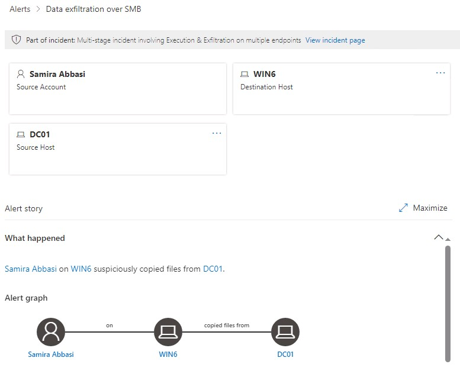
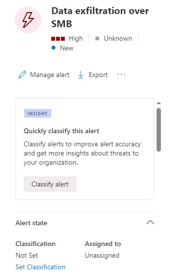
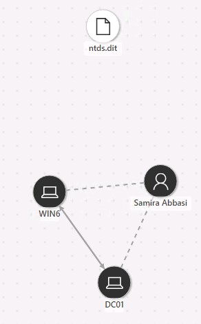
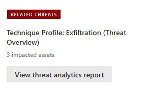
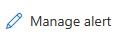

# Task 6.3: Investigate other alerts

Microsoft Defender for Identity is a tool used to discover and analyze attacks. This is an important feature that will help ensure that your environment is secure. Please take your time when analyzing these attacks to become comfortable with their capabilities.

1. In the **DC01 RDP session**, in the browser, if you are not already, go to **[https://security.microsoft.com](https://security.microsoft.com)**.

1. Under Incidents & alerts, select **Alerts**.

1. Locate and then select the **Data exfiltration over SMB** alert to show the details page.

    

    {: .warning }
    > It can take several minutes for the alert to appear. Wait a few minutes, and then refresh the browser. If you don't see the alert, you can continue to the next section and return to investigate the alert in a few minutes.

1. Review the information regarding the **Alert story** on the details page.

1. Review the options on the blade on the right side of the details page.

    

1. Under the Incident details, select the **Incident** link.

1. Review the Incident details page to discover related attacks. This will display additional alerts from the same user or machine.

1. Review the Incident graph.

    

1. Select each object in the Incident graph, and then select **Details** to display information relating to the object.

1. When finished reviewing the Device details, scroll back to the top, and then select **Back to incident details**.

    

1. Under **RELATED THREATS**, select **View threat analytics report**, and then review the details of the report.

    

1. Close the **Threat Analytics** tabs and return to the **Incident-Microsoft Defender** tab.

1. Select the **Alerts** tab, and then select the **Data exfiltration over SMB** to return to the alert details page.

1. On the right panel, select **Manage alert**.

    

1. On the **Manage alert** blade, configure the options according to the following table.

    | Heading | Value |
    |:---------|:---------|
    | Status   | **In progress**  |
    | Assigned to   | **AlexW**   |
    | Classification  | **True positive/Malicious user activity** |
    | Comment | **This attack requires further investigation.**  |

1. Select **Save**, and then close the **Manage alert** blade.

## Next step

In these lab steps we analyzed a subset of the alerts. Please use this time and this sandbox environment to analyze additional alerts and become familiar with the tools and options available.

