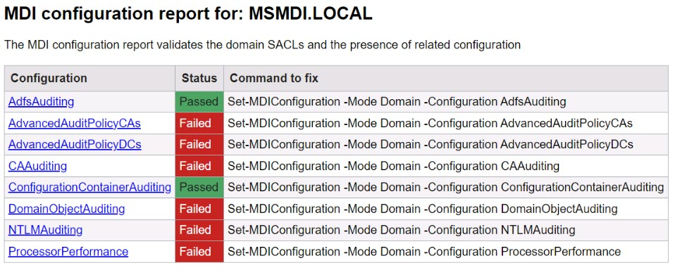
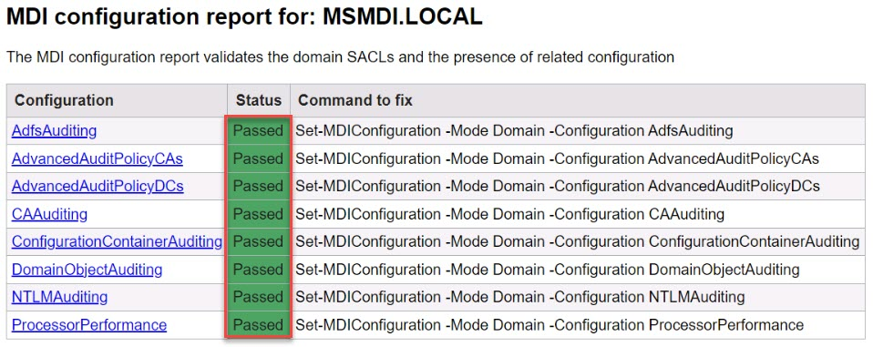

# Task 1.4: Configure audit policies in AD environment

Post-deployment configuration resources: 

[Configure using manual process](https://learn.microsoft.com/defender-for-identity/deploy/configure-windows-event-collection)

[Configure using automated process](https://www.powershellgallery.com/packages/DefenderForIdentity/1.0.0.0)

1. In the DC01 **search** box, enter PowerShell, then right-click **Windows PowerShell** to run as administrator. 

1. In PowerShell, enter the following command to install **Defender for Identity**.  

    ```PowerShell-wrap
    Install-Module -Name DefenderForIdentity
    ```

1. When prompted about installing from an untrusted repository, enter **A** to respond with **Yes** to future prompts. 

1. Enter the following command to generate a report with current configurations: 

    ```PowerShell-wrap
    New-MDIConfigurationReport -Path "C:\Reports" -Mode Domain -OpenHtmlReport
    ```

1. In Microsoft Edge, review the MDI configuration report window for MSMDI.LOCAL.  

    
    
    {: .note }
    > Some failures are expected in the report, but they'll be corrected in the coming steps.

1. Run the following commands in Powershell to fix the failed MDI configurations:
  
    ```PowerShell-wrap
    Set-MDIConfiguration -Mode Domain -Configuration AdfsAuditing
    Set-MDIConfiguration -Mode Domain -Configuration AdvancedAuditPolicyCAs
    Set-MDIConfiguration -Mode Domain -Configuration AdvancedAuditPolicyDCs
    Set-MDIConfiguration -Mode Domain -Configuration CAAuditing
    Set-MDIConfiguration -Mode Domain -Configuration ConfigurationContainerAuditing
    Set-MDIConfiguration -Mode Domain -Configuration DomainObjectAuditing
    Set-MDIConfiguration -Mode Domain -Configuration NTLMAuditing
    Set-MDIConfiguration -Mode Domain -Configuration ProcessorPerformance
    ```

    {: .note }
    > You can safely disregard any warnings relating to Microsoft ADFS or Microsoft Exchange Services.

1. Enter the following command to generate a new configuration report.  

    ```PowerShell-wrap
    New-MDIConfigurationReport -Path "C:\Reports" -Mode Domain -OpenHtmlReport
    ```

    

    In this MDI configuration report for: MSMDI.LOCAL, the status **Passed** for all. 
